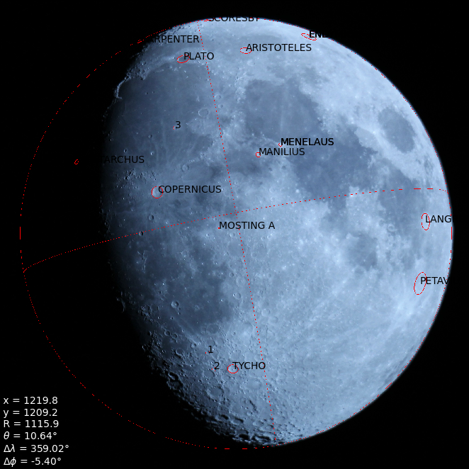

# Projet CODEV 2020
Projet de 1ère année réalisé à l'IMT Atlantique sous la supervision de Jean Le Hir et d'Alain Peden.
L'objectif est de trouver l'[état de libration](https://fr.wikipedia.org/wiki/Libration_lunaire) de la Lune (son orientation par rapport à l'observateur) à partir d'une photographie.
Le programme développé est semi-automatique : l'utilisateur doit renseigner la position précise de quelques cratères connus au préalable. Pour lui faciliter la tâche, une détection automatique de cratères est faite.

## Installation
Python3 et pip doivent être installer.

    pip install numpy matplotlib scikit-image scipy

## Utilisation
Lancer le script `main.py` :

    python main.py

Si vous voulez analyser votre propre image :

    python main.py --img_path mon-image.jpg

Le programme va détecter des cratères et les afficher dans une fenêtre. Vous devrez ensuite les identifier dans l'[Atlas virtuel de la Lune](https://www.ap-i.net/avl/start). En fermant la fenêtre, vous pourrez renseigner leur code L.U.N. un par un. Appuyez sur *q* quand vous avez fini. 

Le résultat s'affiche :
- x, y : position du centre du disque lunaire
- R : rayon du disque lunaire (en pixels)
- θ : inclinaison de la Lune par rapport à la verticale
- Δλ, Δφ : angles de libration

## Licence
Base de données de cratères : Datlun 6.0, copyright (c) 2002-2012 Christian Legrand, Patrick Chevalley